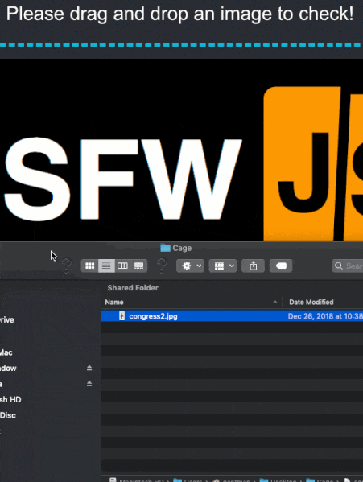

<p align="center">
  
  <h2 align="center">Client-side indecent content checking</h2>
  <hr/>
</p>

NSFWJS isn't perfect, but it's pretty accurate (~90% from our test set of 15,000 test images)... and it's getting more accurate all the time.

The library categoriese images probabilities of the following 5 possible classes:
- `drawings` - safe for work drawings (including anime)
- `hentai` - hentai and pornographic drawings
- `neutral` - safe for work neutral images
- `porn` - pornographic images, sexual acts
- `sexy` - sexually explicit images, not pornography

All in JavaScript on the client's browser.  The images never leave the machine!


The demo is live pushed from the source - Give it a go: http://nsfwjs.com/

## How to use the module

```js
import * as nsfwjs from 'nsfwjs'

const img = document.getElementById('img')

// Load the model.  This pulls from my S3
// please only use this for testing
// See the section on setting up your own model for details
const model = await nsfwjs.load()

// Classify the image
const predictions = await model.classify(img)
console.log('Predictions: ', predictions)
```

## Run the Example

The demo that powers https://nsfwjs.com/ is available in the example folder.

To run the demo, run `yarn prep` which will copy the latest code into the demo.  After that's done, you can `cd` into the demo folder and run with `yarn start`.

## More!

The model was trained in Keras over several days and 60+ Gigs of data.  Be sure to [check out the model code](https://github.com/GantMan/nsfw_model).

#### Open Source
NSFWJS, as open source, is free to use and always will be :heart:.  It's MIT Licensed and we'll always do our best to help and quickly answer issues.  If you'd like to get a hold of us, join our [community slack](http://community.infinite.red).

#### Premium
[Infinite Red](https://infinite.red/) offers premium training and support.  Email us at [hello@infinite.red](mailto:hello@infinite.red) to get in touch.
