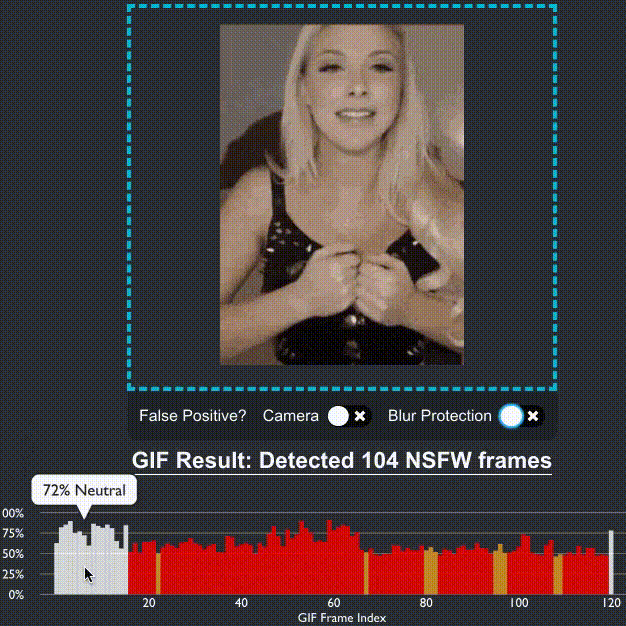
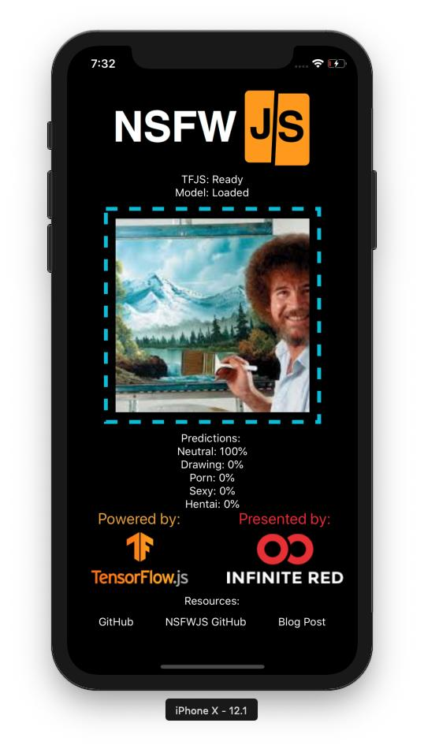

<p align="center">
  
  <h2 align="center">Client-side indecent content checking</h2>
</p>

[](#contributors)
[](https://dl.circleci.com/status-badge/redirect/gh/infinitered/nsfwjs/tree/master)
[](https://app.netlify.com/sites/nsfwjs/deploys)

A simple JavaScript library to help you quickly identify unseemly images; all in the client's browser. NSFWJS isn't perfect, but it's pretty accurate (~90% with small and ~93% with midsized model)... and it's getting more accurate all the time.

Why would this be useful? [Check out the announcement blog post](https://shift.infinite.red/avoid-nightmares-nsfw-js-ab7b176978b1).

<p align="center">

</p>

## **Table of Contents**
<!-- START doctoc generated TOC please keep comment here to allow auto update -->
<!-- DON'T EDIT THIS SECTION, INSTEAD RE-RUN doctoc TO UPDATE -->

- [QUICK: How to use the module](#quick-how-to-use-the-module)
- [Library API](#library-api)
    - [`load` the model](#load-the-model)
    - [`classify` an image](#classify-an-image)
    - [`classifyGif`](#classifygif)
- [Production](#production)
- [Install](#install)
    - [Host your own model](#host-your-own-model)
- [Run the Examples](#run-the-examples)
  - [Tensorflow.js in the browser](#tensorflowjs-in-the-browser)
  - [Browserify](#browserify)
  - [React Native](#react-native)
  - [Node JS App](#node-js-app)
  - [NSFW Filter(Browser Extension)](#nsfw-filter)
- [More!](#more)
    - [Open Source](#open-source)
    - [Premium](#premium)
- [Contributors](#contributors)

<!-- END doctoc generated TOC please keep comment here to allow auto update -->

The library categorizes image probabilities in the following 5 classes:

- `Drawing` - safe for work drawings (including anime)
- `Hentai` - hentai and pornographic drawings
- `Neutral` - safe for work neutral images
- `Porn` - pornographic images, sexual acts
- `Sexy` - sexually explicit images, not pornography

> _The demo is a continuous deployment source - Give it a go: http://nsfwjs.com/_

## QUICK: How to use the module

With `async/await` support:

```js
import * as nsfwjs from 'nsfwjs'

const img = document.getElementById('img')

// Load model from my S3.
// See the section hosting the model files on your site.
const model = await nsfwjs.load()

// Classify the image
const predictions = await model.classify(img)
console.log('Predictions: ', predictions)
```

Without `async/await` support:

```js
import * as nsfwjs from 'nsfwjs'

const img = document.getElementById('img')

// Load model from my S3.
// See the section hosting the model files on your site.
nsfwjs.load()
  .then(function (model) {
    // Classify the image
    return model.classify(img)
  })
  .then(function (predictions) {
    console.log('Predictions: ', predictions)
  })
```

## Library API

#### `load` the model

Before you can classify any image, you'll need to load the model. You should use the optional first parameter and load the model from your website, as explained in the install directions.

Model example - [224x224](https://github.com/infinitered/nsfwjs/blob/master/example/nsfw_demo/public/quant_nsfw_mobilenet/)

```js
const model = nsfwjs.load('/path/to/model/directory/')
```

If you're using a model that needs an image of dimension other than 224x224, you can pass the size in the options parameter.

Model example - [299x299](https://github.com/infinitered/nsfwjs/tree/master/example/nsfw_demo/public/model)

```js
const model = nsfwjs.load('/path/to/different/model/', { size: 299 })
```

If you're using a graph model, you cannot use the infer method, and you'll need to tell model load that you're dealing with a graph model in options.

Model example - [Graph](https://github.com/infinitered/nsfwjs/tree/master/example/nsfw_demo/public/quant_mid)

```js
const model = nsfwjs.load('/path/to/different/model/', { type: 'graph' })
```

If you're using in the browser and you'd like to subsequently load from indexed db or local storage you can save the underlying model using the appropriate scheme and load from there.

```js
const initialLoad = await nsfwjs.load('/path/to/different/model')
await initialLoad.model.save('indexeddb://model')
const model = await nsfwjs.load('indexeddb://model')
```

**Parameters**

- optional URL to the `model.json` folder.
- optional object with size property that your model expects.

**Returns**

- Ready to use NSFWJS model object

#### `classify` an image

This function can take any browser-based image elements (``, `<video>`, `<canvas>`) and returns an array of most likely predictions and their confidence levels.

```js
// Return top 3 guesses (instead of all 5)
const predictions = await model.classify(img, 3)
```

**Parameters**

- Tensor, Image data, Image element, video element, or canvas element to check
- Number of results to return (default all 5)

**Returns**

- Array of objects that contain `className` and `probability`. Array size is determined by the second parameter in the `classify` function.

#### `classifyGif`



This function can take a browser-based image element (``) that is a GIF, and returns an array of prediction arrays. It breaks a GIF into its frames and runs `classify` on each with a given configuration. This can take a while, as GIFs are frequently hundreds of frames.

```js
// Returns all predictions of each GIF frame
const framePredictions = await model.classifyGif(img)
```

If you're looking to update the user on status (_e.g. progress bar_) or change the number of top results per frame, then you can utilize the configuration parameter.

Example of passing a configuration:

```js
// returns top 1 prediction of each GIF frame, and logs the status to console
const myConfig = {
  topk: 1,
  fps: 1,
  onFrame: ({ index, totalFrames, predictions, image }) => {
    console.log({ index, totalFrames, predictions })
    // document.body.appendChild(image)
    // require('fs').writeFileSync(`./file.jpeg`, require('jpeg-js').encode(image).data)
  }
}
const framePredictions = await classifyGif(img, myConfig)
```

**Parameters**

- Image element to check
- Configuration object with the following possible key/values:
  - `topk` - Number of results to return per frame (default all 5)
  - `fps` - Frames per seconds, frames picks proportionally from the middle (default all frames)
  - `onFrame` - Function callback on each frame - Param is an object with the following key/values:
    - `index` - the current GIF frame that was classified (starting at 0)
    - `totalFrames` - the complete number of frames for this GIF (for progress calculations)
    - `predictions` - an array of length `topk`, returning top results from classify
    - `image` - an image of specific frame

**Returns**

- Array of the same order as number of frames in GIF. Each index corresponding to that frame, an returns array of objects that contain `className` and `probability`; sorted by probability and limited by topk config parameter.

## Production

Tensorflow.js offers two flags, `enableProdMode` and `enableDebugMode`. If you're going to use NSFWJS in production, be sure to enable prod mode before loading the NSFWJS model.

```js
import * as tf from '@tensorflow/tfjs'
import * as nsfwjs from 'nsfwjs'
tf.enableProdMode()
//...
let model = await nsfwjs.load(`${urlToNSFWJSModel}`)
```

## Install

NSFWJS is powered by TensorFlow.js as a peer dependency. If your project does not already have TFJS you'll need to add it.

```bash
# peer dependency
$ yarn add @tensorflow/tfjs
# install NSFWJS
$ yarn add nsfwjs
```

For script tags add `<script type="text/javascript" src="https://unpkg.com/nsfwjs"></script>`. Then simply access the nsfwjs global variable. This requires that you've already imported TensorFlow.js as well.

#### Host your own model

The magic that powers NSFWJS is the [NSFW detection model](https://github.com/gantman/nsfw_model). By default, this node module is pulling from my S3, but I make no guarantees that I'll keep that download link available forever. It's best for the longevity of your project that you download and host your own version of [the model files](https://github.com/infinitered/nsfwjs/tree/master/example/nsfw_demo/public/model). You can then pass the relative URL to your hosted files in the `load` function. If you can come up with a way to bundle the model into the NPM package, I'd love to see a PR to this repo!

## Run the Examples

### Tensorflow.js in the browser

The demo that powers https://nsfwjs.com/ is available in the `nsfw_demo` example folder.

To run the demo, run `yarn prep` which will copy the latest code into the demo. After that's done, you can `cd` into the demo folder and run with `yarn start`.

### Browserify

A browserified version using nothing but promises and script tags is available in the `minimal_demo` folder.

Please do not use the script tags hosted in this demo as a CDN. This can and should be hosted in your project along side the model files.

### React Native

The [NSFWJS React Native app](https://github.com/infinitered/nsfwjs-mobile)


Loads a local copy of the model to reduce network load and utilizes TFJS-React-Native. [Blog Post](https://shift.infinite.red/nsfw-js-for-react-native-a37c9ba45fe9)

### Node JS App

Using NPM, you can also use the model on the server side.

```bash
$ npm install nsfwjs
$ npm install @tensorflow/tfjs-node
```

```javascript
const axios = require('axios') //you can use any http client
const tf = require('@tensorflow/tfjs-node')
const nsfw = require('nsfwjs')
async function fn() {
  const pic = await axios.get(`link-to-picture`, {
    responseType: 'arraybuffer',
  })
  const model = await nsfw.load() // To load a local model, nsfw.load('file://./path/to/model/')
  // Image must be in tf.tensor3d format
  // you can convert image to tf.tensor3d with tf.node.decodeImage(Uint8Array,channels)
  const image = await tf.node.decodeImage(pic.data,3)
  const predictions = await model.classify(image)
  image.dispose() // Tensor memory must be managed explicitly (it is not sufficient to let a tf.Tensor go out of scope for its memory to be released).
  console.log(predictions)
}
fn()
```

Here is another full example of a [multipart/form-data POST using Express](example/node_demo), supposing you are using JPG format.

```javascript
const express = require('express')
const multer = require('multer')
const jpeg = require('jpeg-js')

const tf = require('@tensorflow/tfjs-node')
const nsfw = require('nsfwjs')

const app = express()
const upload = multer()

let _model

const convert = async (img) => {
  // Decoded image in UInt8 Byte array
  const image = await jpeg.decode(img, { useTArray: true })

  const numChannels = 3
  const numPixels = image.width * image.height
  const values = new Int32Array(numPixels * numChannels)

  for (let i = 0; i < numPixels; i++)
    for (let c = 0; c < numChannels; ++c)
      values[i * numChannels + c] = image.data[i * 4 + c]

  return tf.tensor3d(values, [image.height, image.width, numChannels], 'int32')
}

app.post('/nsfw', upload.single('image'), async (req, res) => {
  if (!req.file) res.status(400).send('Missing image multipart/form-data')
  else {
    const image = await convert(req.file.buffer)
    const predictions = await _model.classify(image)
    image.dispose()
    res.json(predictions)
  }
})

const load_model = async () => {
  _model = await nsfw.load()
}

// Keep the model in memory, make sure it's loaded only once
load_model().then(() => app.listen(8080))

// curl --request POST localhost:8080/nsfw --header 'Content-Type: multipart/form-data' --data-binary 'image=@/full/path/to/picture.jpg'
```

You can also use [`lovell/sharp`](https://github.com/lovell/sharp) for preprocessing tasks and more file formats.

### NSFW Filter

[**NSFW Filter**](https://github.com/navendu-pottekkat/nsfw-filter) is a web extension that uses NSFWJS for filtering out NSFW images from your browser.

It is currently available for Chrome and Firefox and is completely open-source.

Check out the project [here](https://github.com/navendu-pottekkat/nsfw-filter).

## Learn TensorFlow.js

Learn how to write your own library like NSFWJS with my O'Reilly book "Learning TensorFlow.js" available on [O'Reilly](https://learning.oreilly.com/library/view/learning-tensorflowjs/9781492090786/) and [Amazon](https://amzn.to/3dR3vpY).

[](https://amzn.to/3dR3vpY)

## More!

An [FAQ](https://github.com/infinitered/nsfwjs/wiki/FAQ:-NSFW-JS) page is available.

More about NSFWJS and TensorFlow.js - https://youtu.be/uzQwmZwy3yw

The [model was trained in Keras over several days](https://medium.freecodecamp.org/how-to-set-up-nsfw-content-detection-with-machine-learning-229a9725829c) and 60+ Gigs of data. Be sure to [check out the model code](https://github.com/GantMan/nsfw_model) which was trained on data provided by [Alexander Kim's](https://github.com/alexkimxyz) [nsfw_data_scraper](https://github.com/alexkimxyz/nsfw_data_scraper).

#### Open Source

NSFWJS, as open source, is free to use and always will be :heart:. It's MIT licensed, and we'll always do our best to help and quickly answer issues. If you'd like to get a hold of us, join our [community slack](http://community.infinite.red).

#### Need the experts? Hire Infinite Red for your next project

If your project's calling for the experts in all things React Native, Infinite Red’s here to help! Our experienced team of software engineers have worked with companies like Microsoft, Zoom, and Mercari to bring even some of the most complex projects to life.

Whether it’s running a full project or training a team on React Native, we can help you solve your company’s toughest engineering challenges – and make it a great experience at the same time.
Ready to see how we can work together? [Send us a message](mailto:hello@infinite.red)

## Contributors

Thanks goes to these wonderful people ([emoji key](https://allcontributors.org/docs/en/emoji-key)):

<!-- ALL-CONTRIBUTORS-LIST:START - Do not remove or modify this section -->
<!-- prettier-ignore-start -->
<!-- markdownlint-disable -->
<table>
  <tr>
    <td align="center"><a href="http://gantlaborde.com/"><br /><sub><b>Gant Laborde</b></sub></a><br /><a href="#question-GantMan" title="Answering Questions">💬</a> <a href="#blog-GantMan" title="Blogposts">📝</a> <a href="https://github.com/infinitered/nsfwjs/commits?author=GantMan" title="Code">💻</a> <a href="#example-GantMan" title="Examples">💡</a> <a href="#ideas-GantMan" title="Ideas, Planning, & Feedback">🤔</a> <a href="#infra-GantMan" title="Infrastructure (Hosting, Build-Tools, etc)">🚇</a> <a href="https://github.com/infinitered/nsfwjs/pulls?q=is%3Apr+reviewed-by%3AGantMan" title="Reviewed Pull Requests">👀</a> <a href="https://github.com/infinitered/nsfwjs/commits?author=GantMan" title="Tests">⚠️</a></td>
    <td align="center"><a href="https://jamonholmgren.com"><br /><sub><b>Jamon Holmgren</b></sub></a><br /><a href="https://github.com/infinitered/nsfwjs/commits?author=jamonholmgren" title="Documentation">📖</a> <a href="#ideas-jamonholmgren" title="Ideas, Planning, & Feedback">🤔</a> <a href="https://github.com/infinitered/nsfwjs/commits?author=jamonholmgren" title="Code">💻</a> <a href="#content-jamonholmgren" title="Content">🖋</a></td>
    <td align="center"><a href="https://github.com/jstudenski"><br /><sub><b>Jeff Studenski</b></sub></a><br /><a href="#design-jstudenski" title="Design">🎨</a></td>
    <td align="center"><a href="https://github.com/fvonhoven"><br /><sub><b>Frank von Hoven III</b></sub></a><br /><a href="https://github.com/infinitered/nsfwjs/commits?author=fvonhoven" title="Documentation">📖</a> <a href="#ideas-fvonhoven" title="Ideas, Planning, & Feedback">🤔</a></td>
    <td align="center"><a href="https://github.com/sandeshsoni"><br /><sub><b>Sandesh Soni</b></sub></a><br /><a href="https://github.com/infinitered/nsfwjs/commits?author=sandeshsoni" title="Code">💻</a></td>
    <td align="center"><a href="https://github.com/seannam1218"><br /><sub><b>Sean Nam</b></sub></a><br /><a href="https://github.com/infinitered/nsfwjs/commits?author=seannam1218" title="Documentation">📖</a></td>
    <td align="center"><a href="https://github.com/emer7"><br /><sub><b>Gilbert Emerson</b></sub></a><br /><a href="https://github.com/infinitered/nsfwjs/commits?author=emer7" title="Code">💻</a></td>
  </tr>
  <tr>
    <td align="center"><a href="https://github.com/xilaraux"><br /><sub><b>Oleksandr Kozlov</b></sub></a><br /><a href="#infra-xilaraux" title="Infrastructure (Hosting, Build-Tools, etc)">🚇</a> <a href="https://github.com/infinitered/nsfwjs/commits?author=xilaraux" title="Tests">⚠️</a> <a href="https://github.com/infinitered/nsfwjs/commits?author=xilaraux" title="Code">💻</a></td>
    <td align="center"><a href="http://morganlaco.com"><br /><sub><b>Morgan</b></sub></a><br /><a href="https://github.com/infinitered/nsfwjs/commits?author=mlaco" title="Code">💻</a> <a href="#ideas-mlaco" title="Ideas, Planning, & Feedback">🤔</a></td>
    <td align="center"><a href="http://mycaule.github.io/"><br /><sub><b>Michel Hua</b></sub></a><br /><a href="https://github.com/infinitered/nsfwjs/commits?author=mycaule" title="Code">💻</a> <a href="https://github.com/infinitered/nsfwjs/commits?author=mycaule" title="Documentation">📖</a></td>
    <td align="center"><a href="https://www.infinite.red"><br /><sub><b>Kevin VanGelder</b></sub></a><br /><a href="https://github.com/infinitered/nsfwjs/commits?author=kevinvangelder" title="Code">💻</a> <a href="https://github.com/infinitered/nsfwjs/commits?author=kevinvangelder" title="Documentation">📖</a></td>
    <td align="center"><a href="http://technikempire.com"><br /><sub><b>Jesse Nicholson</b></sub></a><br /><a href="#data-TechnikEmpire" title="Data">🔣</a> <a href="#ideas-TechnikEmpire" title="Ideas, Planning, & Feedback">🤔</a></td>
    <td align="center"><a href="https://github.com/camhart"><br /><sub><b>camhart</b></sub></a><br /><a href="https://github.com/infinitered/nsfwjs/commits?author=camhart" title="Documentation">📖</a></td>
    <td align="center"><a href="https://github.com/Cameron-Burkholder"><br /><sub><b>Cameron Burkholder</b></sub></a><br /><a href="#design-Cameron-Burkholder" title="Design">🎨</a></td>
  </tr>
  <tr>
    <td align="center"><a href="https://qwertyforce.ru"><br /><sub><b>qwertyforce</b></sub></a><br /><a href="https://github.com/infinitered/nsfwjs/commits?author=qwertyforce" title="Documentation">📖</a></td>
    <td align="center"><a href="https://github.com/YegorZaremba"><br /><sub><b>Yegor <3</b></sub></a><br /><a href="https://github.com/infinitered/nsfwjs/commits?author=YegorZaremba" title="Code">💻</a> <a href="https://github.com/infinitered/nsfwjs/commits?author=YegorZaremba" title="Tests">⚠️</a></td>
    <td align="center"><a href="http://navendu.me"><br /><sub><b>Navendu Pottekkat</b></sub></a><br /><a href="https://github.com/infinitered/nsfwjs/commits?author=navendu-pottekkat" title="Documentation">📖</a></td>
    <td align="center"><a href="https://github.com/VladStepanov"><br /><sub><b>Vladislav</b></sub></a><br /><a href="https://github.com/infinitered/nsfwjs/commits?author=VladStepanov" title="Code">💻</a> <a href="https://github.com/infinitered/nsfwjs/commits?author=VladStepanov" title="Documentation">📖</a></td>
    <td align="center"><a href="https://github.com/nacht42"><br /><sub><b>Nacht</b></sub></a><br /><a href="https://github.com/infinitered/nsfwjs/commits?author=nacht42" title="Code">💻</a></td>
    <td align="center"><a href="https://github.com/kateinkim"><br /><sub><b>kateinkim</b></sub></a><br /><a href="https://github.com/infinitered/nsfwjs/commits?author=kateinkim" title="Code">💻</a> <a href="https://github.com/infinitered/nsfwjs/commits?author=kateinkim" title="Documentation">📖</a></td>
    <td align="center"><a href="https://janpoonthong.github.io/portfolio/"><br /><sub><b>jan</b></sub></a><br /><a href="https://github.com/infinitered/nsfwjs/commits?author=JanPoonthong" title="Documentation">📖</a></td>
  </tr>
  <tr>
    <td align="center"><a href="https://github.com/roerohan"><br /><sub><b>Rohan Mukherjee</b></sub></a><br /><a href="#question-roerohan" title="Answering Questions">💬</a> <a href="#infra-roerohan" title="Infrastructure (Hosting, Build-Tools, etc)">🚇</a> <a href="#maintenance-roerohan" title="Maintenance">🚧</a> <a href="https://github.com/infinitered/nsfwjs/commits?author=roerohan" title="Code">💻</a></td>
  </tr>
</table>

<!-- markdownlint-enable -->
<!-- prettier-ignore-end -->
<!-- ALL-CONTRIBUTORS-LIST:END -->

This project follows the [all-contributors](https://github.com/all-contributors/all-contributors) specification. Contributions of any kind welcome!
